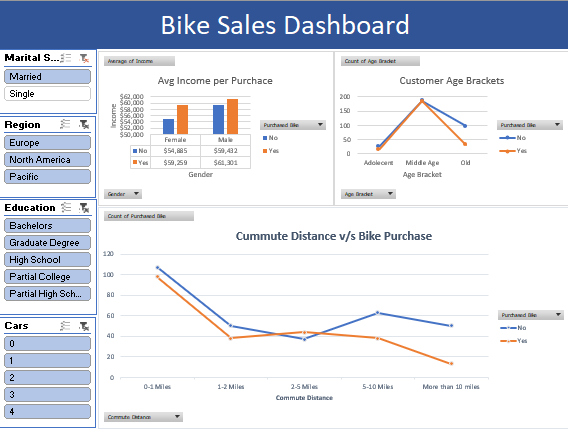

# 🏍️ Bike Buyer Dashboard

## Overview
This Excel project analyzes **bike purchase behavior** based on demographic and regional data. It uses Excel’s built-in tools—pivot tables and charts—to uncover key insights such as purchase patterns, customer profiles, and potential target segments.

The goal is to demonstrate data cleaning, analysis, and visualization skills using Excel alone—no Power Query or macros—making it simple and portable for recruiters to review.

---

## 📂 File Structure
| Sheet Name | Description |
|-------------|--------------|
| **bike_buyers** | Raw dataset containing customer demographics, income, region, and purchase status |
| **Working Sheet** | Cleaned and filtered dataset used for pivot table analysis |
| **Pivot Table** | Core analysis layer summarizing patterns across gender, income, region, and marital status |
| **Dashboard sheet** | Interactive dashboard visualizing key insights through charts and KPIs |

---

## 📊 Key Insights (Example Highlights)
- High-income professionals show higher bike purchase probability  
- Suburban and urban customers contribute most to total sales  
- Marital status and commute distance influence buying behavior  


---

## 🧠 Skills Demonstrated
- Data Cleaning and Transformation in Excel  
- Pivot Table Design and Custom Grouping  
- Dashboard Design using Charts and Slicers  
- Data-Driven Storytelling  

---

## 🚀 How to Use
1. Download the Excel file: `Bike Buyer Dashboard.xlsx`  
2. Open in Excel 2016 or later  
3. Navigate between sheets to explore raw data → analysis → dashboard  
4. Use slicers on the Dashboard to interact with visuals  

---

## 📸  Screenshots 
Screenshots in a `/screenshots` folder :
- `dashboard_view.png` — full dashboard view  
- `pivot_table.png` — snapshot of the analysis table  
- `data_preview.png` — first few rows of cleaned data  

Example usage in README:
```markdown

```

---

## ⚙️ Repo Structure
```
📁 Bike-Buyer-Dashboard/
│
├── Bike Buyer Dashboard.xlsx
├── README.md
├── .gitignore
└── screenshots/
    ├── dashboard_view.png
    ├── pivot_table.png
    └── data_preview.png
```

---

## .gitignore
```
# Ignore temporary Excel and system files
~$*
*.tmp
*.bak
.DS_Store
Thumbs.db
```
